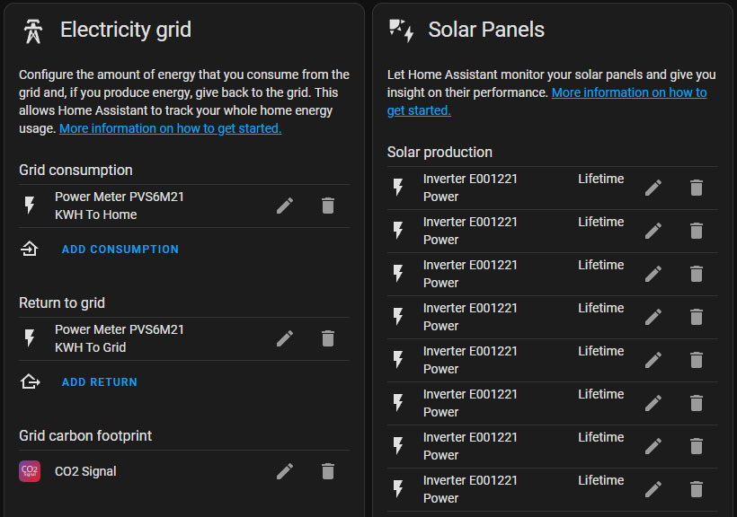
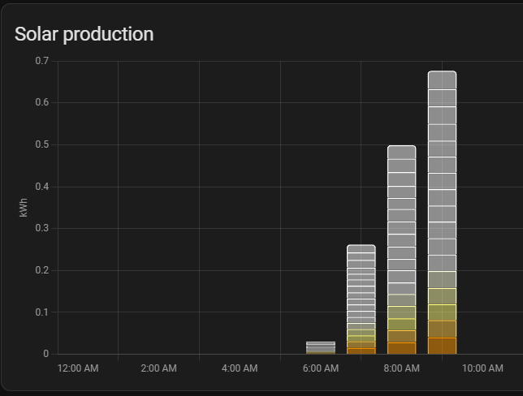

# hass-sunpower

Home Assistant SunPower Integration using the local installer ethernet interface.

[![GitHub Release][releases-shield]][releases]
[![GitHub Activity][commits-shield]][commits]

![Project Maintenance][maintenance-shield]

## ***🟥 WARNING 🟥***

This integration uses endpoints designed for the provisioning of the PVS system.
They were not intended to be called over and over for days/months/years on end.
I have seen PVS systems eventually failing to push data to Sunpower's
cloud systems even though everything else (this integration included) were working.
This happened to my system and I did a bunch of gymnastics some of the errors
suggested it might have been due to a partition filling on the PVS.  I would
certainly use caution with short polling rates.

YMMV, any damage to your system is your responsibility (see also: [LICENSE](LICENSE))

## Component to integrate with [sunpower][sunpower-us] PVS 5/6 monitors

**This component will set up the following platforms.**

| Platform        | Description                                                       |
| --------------- | ----------------------------------------------------------------- |
| `binary_sensor` | Working/Not Working status for each device.                       |
| `sensor`        | Most data available from the PVS system including per-panel data. |

## Installation

1. Click install.
2. Install HACS
3. Add this Repo to HACS by going to the 3 dots on the right ...-> Custom repositories ->
 Repository: krbaker/hass-sunpower Category: integration
4. Install this integration in HACS
5. Restart Home Assistant
6. In the Home Assistant UI go to "Configuration" -> "Integrations" click "+" and search for "Sunpower".
   * The main configuration is IP/Hostname. If setup with a NAT as described below the IP will be 172.27.153.1.
   Note the network setup is for most people the challenging setup of this integration.
   * Requires that the management LAN interface is plugged in,
   your installer uses this for setup but doesn't plug it into your lan
   * This network interface has a DHCP server running on it. If you plug it straight into your
   home network it will make probably other systems stop working as they will DHCP to the wrong
   address.
   * If you have a battery you can enable collecting that data with 'use-ess'
   * Be careful changing the refresh intervals for ESS or PVS.
   The PVS takes a very long time to return data, I've found 120s is really the lowest safe rate.
   ESS I'm less sure about though I've seen it as low as 10s in other places
   (I have seen home assistant grind to a hault with too many state change entries)

## Use descriptive entity names

When selected during installation, entities added for each device will have the device
descriptor added onto the front of their name.  The device descriptor is a combination of
device type (e.g., Inverter) and serial number.  This guarantees unique entity IDs and names
at the expense of making said names very long.

## Use product entity names

When selected during installation, entities added for each device will have the "product"
descriptor added onto the front of their name.  This adds 'sunpower' 'sunvault' and 'pvs'
to entities making them even more distinct but *very* long.

## Use energy storage system

If you have a SunVault system along side your solar you can select this option to
include data from the energy storage system.  (This addition thanks to [@CanisUrsa](https://github.com/CanisUrsa))

## Solar data update interval (seconds)

This sets how fast the integration will try to get updated solar info from the PVS.
The lowest "safe" rate looks like about 120 seconds.  I am concerned some PVSs may fail
to work properly over time and I'm guessing it might be request or error logging filling
their memory.  I am running with 300 seconds right now as I went through a heck of a time
with a PVS that began to fail pushing to Sunpower's cloud.

## Energy storage update interval (seconds)

Should evenly divide into Solar data update interval or be an even multiple of it (this is due to the
currently silly way polling is handled through one timer).  The original author of the ESS addon
[@CanisUrsa](https://github.com/CanisUrsa) had it as low as 20 seconds (see warning above)

## Network Setup

This integration requires connectivity to the management interface used for installing the system.
The PVS systems have a second lan interface in the box.  *DO NOT PLUG THIS INTO YOUR LAN!!!*
it is running its own DHCP server which will cause all sorts of IP addressing issues.
I run a Linux router with a spare ethernet port and route to the sunpower interface and allow
my home assistant system to connect directly to the PVS.  Also note that the command used to
dump data 'device list' is very slow and sometimes times out.  I've built in some retry logic
so setup passes pretty reliably.  Sometimes you may see data go blank if the fetch times out.

A detailed setup using a Raspberry Pi which fits into the PVS is [available here][pi_setup].

## Devices

Depending on the version of PVS you may not see all of these devices/attributes.
I'm guessing on a number of these attributes based on what I've observed.  Updates welcome!

### PV Supervisor

This is the integrated computer that monitors your panels.  Currently this supports the PVS 5
and PVS 6.  The serial number is used for the device ID to avoid collisions.

| Entity                 | Units    | Description                                                                                                                         |
| ---------------------- | -------- | ----------------------------------------------------------------------------------------------------------------------------------- |
| `Memory Used`          | Bytes    | How much memory is consumed on the PVS.                                                                                             |
| `Flash Available`      | Bytes    | How much flash space is left.                                                                                                       |
| `Error Count`          | Bytes    | Internal error count (never seen more than 0 here).                                                                                 |
| `Communication Errors` | Bytes    | Number of failures talking to panels? (this goes up and down which doesn't seem right).                                             |
| `Scan Time`            | Bytes    | How long it took to poll the panels                                                                                                |
| `Skipped Scans`        | Count    | How many times the system has skipped polling the panels for data                                                                   |
| `System Load`          | Load Avg | Load average like number, unclear over what time period.  Average number of tasks in run queue average over time.                   |
| `System State`         | String   | Pass through from the API, sometimes goes unknown if the API times out (the local API is horribly slow and takes > 1 min sometimes) |
| `Untransmitted Data`   | Bytes    | How much data is in PVS buffers not sent to Sunpower cloud.                                                                         |
| `Uptime`               | Seconds  | How long the system has been running, appears to restart on its own fairly frequently (firmware ups?).                              |

### Power Meter

This is the power meter built into the PVS.  The serial number is used for the device ID to
avoid collisions.  All systems I have seen have two meters one ends in 'p' for production
(from panels) and 'c' for consumption (use by household).

| Entity           | Units   | Description                                                                                                                                             |
| ---------------- | ------- | ------------------------------------------------------------------------------------------------------------------------------------------------------- |
| `System State`   | String  | Pass through from the API, sometimes goes unknown if the API times out (the local API is horribly slow and takes > 1 min sometimes)                     |
| `Frequency`      | Hz      | Observed AC Frequency.  Resolution appears to be .1hz.  My powerwall shifts the frequency to shutdown my panels when charged 100% stays within +- .1hz. |
| `Lifetime Power` | kwh     | Net power through this meter.  Note that this *will* 'spin backwards' and make home assistant log errors if you draw anything here.                     |
| `Power`          | kw      | Current power through this meter.                                                                                                                       |
| `Power Factor`   | Percent | [Power Factor][power-factor] is better explained by Wikipedia.                                                                                          |
| `KVA Apparent`   | VA      | See above                                                                                                                                               |
| `KVA Reactive`   | VA      | See above                                                                                                                                               |

### Inverter

This is the data from each Micro Inverter.  Each inverter optimizes the power generation
using [MPPT][mppt] all of the panel side power data is reported from each inverter.
You should see one of these for every panel you have, they are listed by serial number.

| Entity           | Units  | Description                                                                                                                                              |
| ---------------- | ------ | -------------------------------------------------------------------------------------------------------------------------------------------------------- |
| `System State`   | String | Pass through from the API, sometimes goes unknown if the API times out, returns 'error' on my system more than I would expect.                           |
| `Frequency`      | Hz     | Observed AC Frequency.  Resolution appears to be .01hz.  My powerwall shifts the frequency to shutdown my panels when charged 100% stays within +- .1hz. |
| `Lifetime Power` | kwh    | Lifetime produced power from this panel / inverter                                                                                                       |
| `Power`          | kw     | Current power from this panel / inverter                                                                                                                 |
| `Voltage`        | Volts  | Power this panel is seeing (wired across both phases so seeing 240+-)                                                                                    |
| `Temperature`    | F      | Temperature of this inverter, can get fairly warn on a sunny day developing full power                                                                   |
| `Amps`           | Amps   | Power this inverter is producing on the AC side                                                                                                          |
| `MPPT Volts`     | Volts  | [MPPT][mppt] optimized panel voltage.  This is the actual voltage the panel is driven by inverter to develop currently.                                  |
| `MPPT Amps`      | Amps   | [MPPT][mppt] optimized panel amperage.  This is the actual amperage the panel is driven by inverter to develop currently.                                |
| `MPPT KW`        | KW     | [MPPT][mppt] optimized panel output in kw.  This is the actual power the panel developing currently.                                                     |

### HUB+

This is the data from the HUB+.

| Entity                          | Units  | Description                                                                                                        |
| ------------------------------- | ------ | ------------------------------------------------------------------------------------------------------------------ |
| `HUB Plus State`                | String | Pass through from the API, sometimes goes unknown if the API times out, returns 'error' on my system all the time. |
| `HUB Plus Grid Phase 1 Voltage` | Volts  | Phase 1 grid voltage.                                                                                              |
| `HUB Plus Grid Phase 2 Voltage` | Volts  | Phase 2 grid voltage.                                                                                              |
| `HUB Plus Temperature`          | C      | Temperature of the HUB+.                                                                                           |
| `HUB Plus Load Phase 1 Voltage` | Volts  | Phase 1 load voltage.                                                                                              |
| `HUB Plus Load Phase 2 Voltage` | Volts  | Phase 2 load voltage.                                                                                              |

### Battery Management System

This is the data from each Battery Management System. Each BMS is responsible
for the batteries contained within it.

| Entity                               | Units  | Description                                                                                                        |
| ------------------------------------ | ------ | ------------------------------------------------------------------------------------------------------------------ |
| `Battery # State`                    | String | Pass through from the API, sometimes goes unknown if the API times out, returns 'error' on my system all the time. |
| `Battery # Amps`                     | Amps   | Battery amps.                                                                                                      |
| `Battery # Voltage`                  | Volts  | Battery voltage.                                                                                                   |
| `Battery # Temperature`              | C      | Battery temperature.                                                                                               |
| `Battery # Customer State of Charge` | %      | Battery charge percentage reported to the customer.                                                                |
| `Battery # System State of Charge`   | %      | Actual battery charge percentage (probably).                                                                       |

### Energy Storage System

This is the data from each Energy Storage System. The ESS is responsible for something.
I am not sure what.

| Entity                  | Units  | Description                                                                                                        |
| ----------------------- | ------ | ------------------------------------------------------------------------------------------------------------------ |
| `ESS # State`           | String | Pass through from the API, sometimes goes unknown if the API times out, returns 'error' on my system all the time. |
| `ESS # Humidity`        | %      | Humidity measured by the ESS.                                                                                      |
| `ESS # Temperature`     | C      | Temperature of the ESS.                                                                                            |
| `ESS # Power`           | Watts  | Power of the ESS.                                                                                                  |
| `ESS # Meter A Amps`    | Amps   | ESS meter A amps.                                                                                                  |
| `ESS # Meter A Power`   | Watts  | ESS meter A power.                                                                                                 |
| `ESS # Meter A Voltage` | Volts  | ESS meter A voltage.                                                                                               |
| `ESS # Meter B Amps`    | Amps   | ESS meter B amps.                                                                                                  |
| `ESS # Meter B Power`   | Watts  | ESS meter B power.                                                                                                 |
| `ESS # Meter B Voltage` | Volts  | ESS meter B voltage.                                                                                               |

## Energy Monitoring

This integration should support the Energy dashboard for Home Assistant.
Once you install the integration and configure it allow it to run for a few hours so that the
statistics entries are generated.  Then go to the energy dashboard configuration and add the
measurements you want.  Some people use the main consumption and production meters,
others use each panel.

### SunVault Monitoring

The energy storage system data doesn't record total kWh and instead only provides voltage / current
of the individual battery management systems. The instanteous power is calculated per battery
and an abstract battery called "SunVault" is generated to cover systems with more than one BMS.
For the SunVault device an integration helper is required to integrate the instanteous power
calculated by this integration and turn it into kWh. This can be done through Settings ->
Devices and Integration -> Helpers -> Create Helper -> Integration - Riemann sum integral sensor.
An integration sensor will need to be generated for both the SunVault Power Input and SunVault
Power Output.

## Debugging

If you file a bug one of the most useful things to include is the output of
> curl <http://172.27.153.1/cgi-bin/dl_cgi?Command=DeviceList>

### Missing solar production. Appears that the Sunpower meter has disappeared from the device list

Run the debugging command and look for the METER entries.
> curl <http://172.27.153.1/cgi-bin/dl_cgi?Command=DeviceList>
If one is missing reboot the PVS

### Missing Consumption or Consumption is wrong

Check your Sunpower app.  If its not there this integaration will not solve it.

* Your install may not have installed the current clamps needed.
 Sometimes the installer is being cheap, sometimes you just don't have the space in your panel.
* Its possible your PVS just needs a reboot (see missing solar production entry)
* If your consumption is just wrong (the most common failure is seeing the solar production count
as consumption) then the PVS is configured wrong
[Sunpower Training](https://us.sunpower.com/sites/default/files/sunpower-training-tuesday-consumption-junction_0.pdf)
is what they should follow to resolve this.

### Installed through HACS but I can't find it in the integrations list

Some people seem to have a browser caching / refresh issue it seems to be solved by completely
clearing caches or using another browser.
See [Issue-15](https://github.com/krbaker/hass-sunpower/issues/15)

***
[mppt]: https://en.wikipedia.org/wiki/Maximum_power_point_tracking
[power-factor]: https://en.wikipedia.org/wiki/Power_factor
[commits-shield]: https://img.shields.io/github/commit-activity/y/custom-components/blueprint.svg?style=for-the-badge
[commits]: https://github.com/krbaker/hass-sunpower/commits/master
[maintenance-shield]: https://img.shields.io/badge/maintainer-Keith%20Baker%20%40krbaker-blue.svg?style=for-the-badge
[releases-shield]: https://img.shields.io/github/release/krbaker/hass-sunpower.svg?style=for-the-badge
[releases]: https://github.com/krbaker/hass-sunpower/releases
[sunpower-us]: https://us.sunpower.com/products/solar-panels
[pi_setup]: https://starreveld.com/PVS6%20Access%20and%20API.pdf
