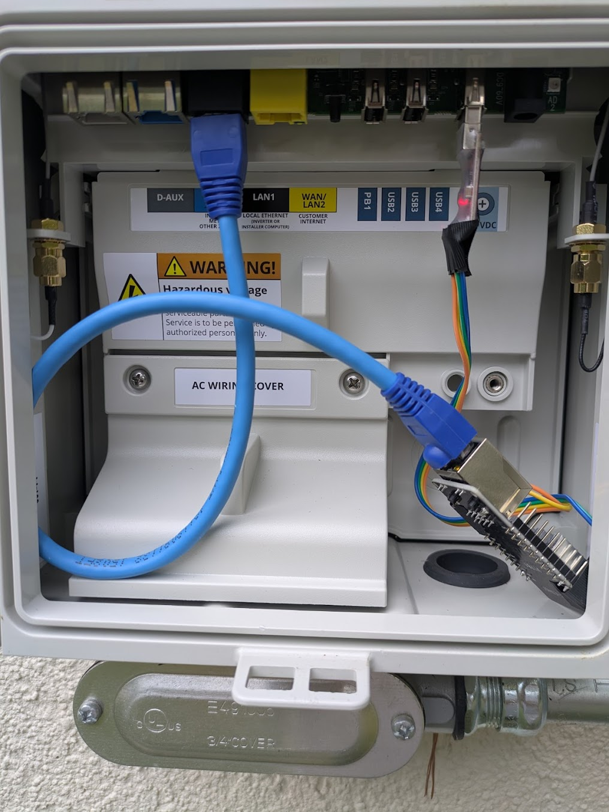
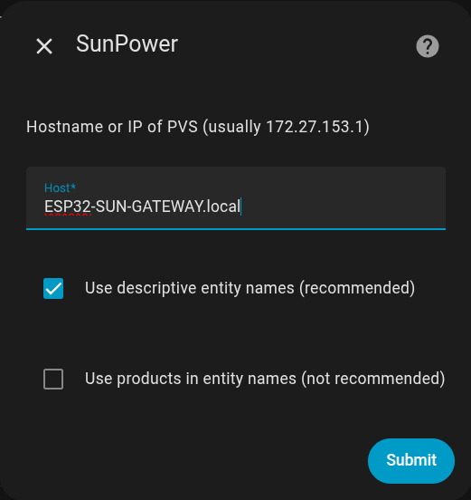

### Ethernet-WiFi proxy


This guide explains how to build a WiFi--Ethernet proxy device using an ESP32 (WT32-ETH01) to connect a SunPower PVS5 to Home Assistant.

A similar approach using a Raspberry Pi is documented here:
https://starreveld.com/PVS6%20Access%20and%20API.pdf

However, a Raspberry Pi consumes around 5 W, which turns into heat. If your PVS enclosure is mounted on a sunny wall, this heat buildup can cause unstable connections or device restarts. By contrast, the ESP32 uses only about 0.25 W, making it far better suited for this task.


## Hardware

No soldering is required.


Get WT32-ETH01 development board

For example:
https://www.amazon.com/WT32-ETH01-Development-Embedded-Bluetooth-Dual-Mode


Get Serial-to-USB adapter

For example:
https://www.amazon.com/dp/B00LODGRV8


Connect the 5V terminal of the serial-to-USB with 5V terminal of WT32-ETH01.
GND terminal to GND of WT32-ETH01.

TXD terminal of serial-to-USB to RXD of WT32-ETH01.
RXD terminal of serial-to-USB to TXD of WT32-ETH01.


Double check the connections: TX→RX, RX→TX, 5V, GND.


## Software

- Install Arduino Studio.

- Add this URL in Preferences → Additional Board Manager URLs:
https://espressif.github.io/arduino-esp32/package_esp32_index.json

- Compile the provided sketch.

- Install any missing libraries.

- Enter your WiFi SSID and password in the code.


First Flashing (via USB):

Connect IO0 → GND with a jumper wire.
Briefly short EN → GND (e.g., touch the two terminals with a screwdriver).
Release IO0.

Upload the code from Arduino IDE.

After first upload, you can update firmware over-the-air (OTA).


Once upload finishes go to:
http://ESP32-SUN-GATEWAY.local/gatewaystatus

It should return:
```JSON
{
  "wifi_connected": true,
  "wifi_ip": "<IP ADDRESS OF YOUR ESP32>",
  "eth_connected": false,
  "eth_ip": "172.27.153.2",
  "eth_gateway": "172.27.153.1",
  "uptime_ms": 550853
}
```

Now remove wires from EN and IO0. Tape up the rest of wires to make sure they sit firmly.

Now plug the Serial-to-USB adapter into any USB port inside the SunPower PVS enclosure.
Use a short Ethernet cable to connect the WT32-ETH01 to the PVS.

Recheck the status:
http://ESP32-SUN-GATEWAY.local/gatewaystatus


It should return:
```JSON
{
  "wifi_connected": true,
  "wifi_ip": "<IP ADDRESS OF YOUR ESP32>",
  "eth_connected": true,
  "eth_ip": "172.27.153.2",
  "eth_gateway": "172.27.153.1",
  "uptime_ms": 550853
}
```


Finally, test the device list endpoint:
http://ESP32-SUN-GATEWAY.local/cgi-bin/dl_cgi?Command=DeviceList

After a short delay, you should see a JSON response containing your solar panel data.








